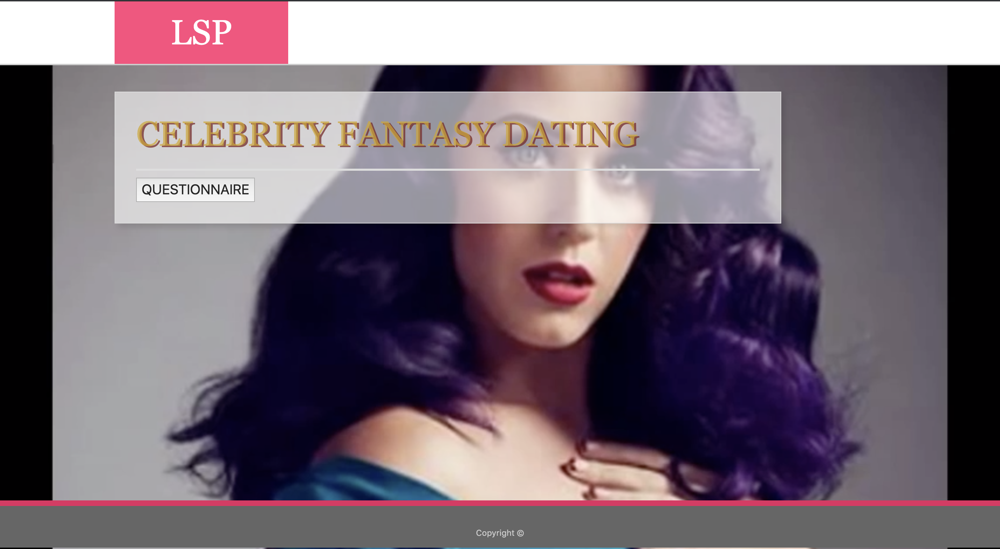
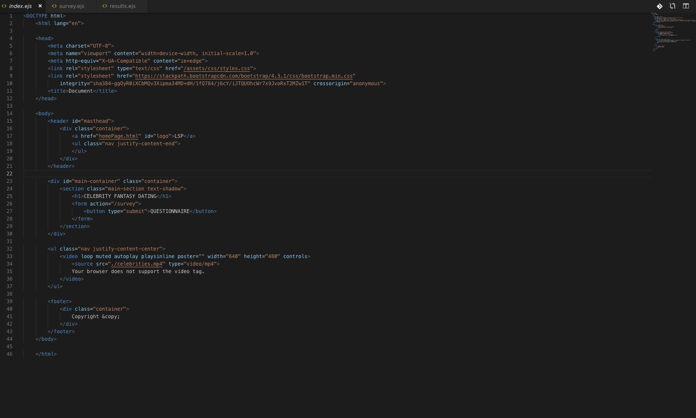
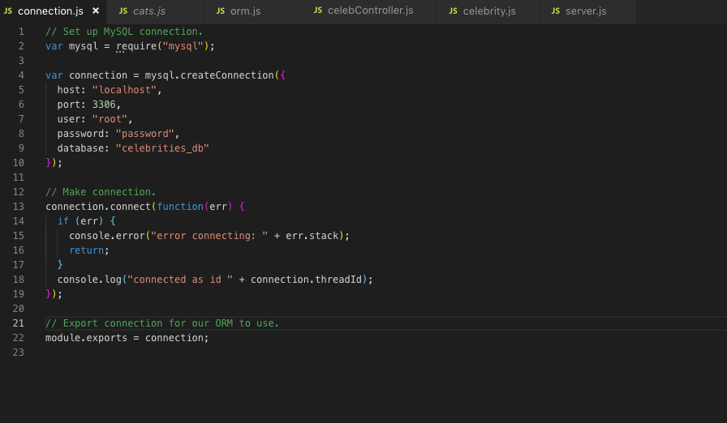

# Star Trap

## Description
    
This is a celebrity fantasy dating game. The game is meant as something users find and play while browsing celebrity gossip websites. Our intentions were to create something fun. Something that could essentially be clickbait on online (celebrity) news sites, specifically Celebrity news sites, such as TMZ, ShadeRoom, or Buzzfeed.

### Example of how our clickbait would look.

## Motivation
    
Our motivaton was to create something fun for a world obsessed with celebrities and drama. Sometimes living vicuriously is a fun thing to do. We decided to seewhich celebrity you are most compatible with. 
    
## Results

We are able to match the users zodiac sign to their compatible celebrity. We are currently able to get the results we need from the console but achieving this on the results page was a hard task. Our codes did not match at the time to get the one result we needed. We had a nice front end and a pretty bulky backend but something was wrong in they way we requested our users' input and how it was displayed.

## Tech Used

### Node 
### Express

## Embedded JavaScript Templates (New Tech)

We used EJS (Embedded JavaScript Templates). This is a really cool because it to links HTML and Javascript.

"EJS is a simple templating language that lets you generate HTML markup with plain JavaScript. No religiousness about how to organize things. No reinvention of iteration and control-flow. It's just plain JavaScript."

## Team Efforts
    
Our goal was to build a functioning app that was also visually appealing to the user. Users all always scrolling through social media reading about celebrity lifestyles and love lives. Everyone wants to be apart of their universe.

## Individual Challenges

Our challenges involved being able to sync all our work and being able to get the results function to show. It was pretty nerverwracking not being able to ge the results we spent a lot of time 

## Challenges

We had many challenges with our project. The first was showing results for all questionnaire inquiries. Then just showing one result was our issue. But we got it to work. Our next endevour, was to match the CSS to the HTML that was getting the results from our database.
    
## Improvements
    
In the future we would like to make this app more functonal with all the questions being able to return results from our database. We want this to be a fun app for users to just spend their mindless  internet time on. Sometimes all code doesn't have to have an important significance ior pleasing.

## Snippets of our Code and Database.

### Establishing our connection...

### ORM Object Relational Mapping...

### Our Controller...

### Our Database...

## Our Presentation

https://docs.google.com/presentation/d/1RxEQWBx-rhv6NK61hTGaWaQ7U6-SXTKtPdwna4tPXRk/edit?usp=sharing

